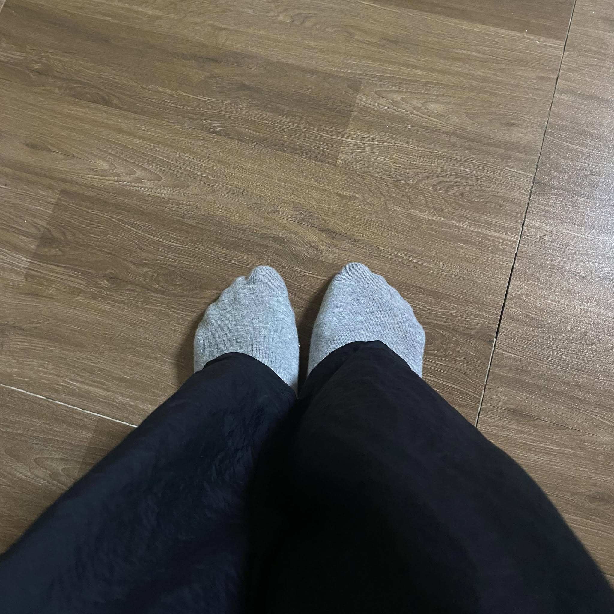

# Hi there, I'm Vinh! 👋

<div align="center">
  
[](https://git.io/typing-svg)


[](https://github.com/vinhpad?tab=followers)
[](https://github.com/vinhpad)

</div>
## 🚀 About Me

<div align="center">
  
</div>

```yaml
Name: Vinh Nguyen
Education: Master Student at UET - VNU
Interests: 
  - Machine Learning & Deep Learning
  - Algorithm Optimization
  - Competitive Programming
  - Full Stack Development
Location: Vietnam
Status: Open for opportunities
```

<div align="center">
  
  
</div>

## 🛠️ Tech Stack & Tools

### Programming Languages


### Frameworks & Libraries


### Databases & Cloud


### Tools & OS


## 📊 GitHub Analytics

<div align="center">
  
</div>

<div align="center">
  
</div>

## 🏆 Achievements & Certifications

- 🥇 **Competitive Programming**: Multiple contest participations
- 📚 **Academic**: Master's Degree in Computer Science (In Progress)
- 💻 **Open Source**: Contributing to various projects
- 🎯 **Focus Areas**: Machine Learning, Algorithm Optimization, Full Stack Development

## 📫 Let's Connect!

<div align="center">
  
[](https://www.facebook.com/vinhpad/)
[](https://www.linkedin.com/in/mangoboss/)
[](mailto:your.email@gmail.com)
[](https://your-portfolio.com)

</div>

---
<div align="center">
  
**💡 "Code is like humor. When you have to explain it, it's bad." - Cory House**

⭐ From [vinhpad](https://github.com/vinhpad)

</div>
